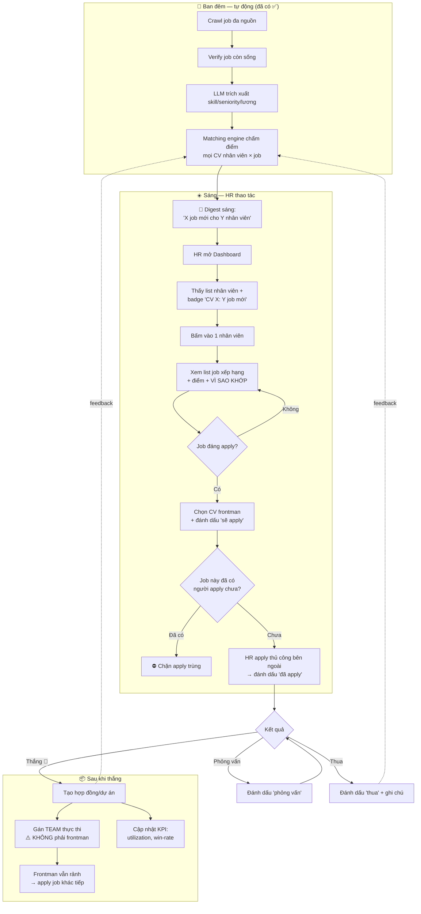
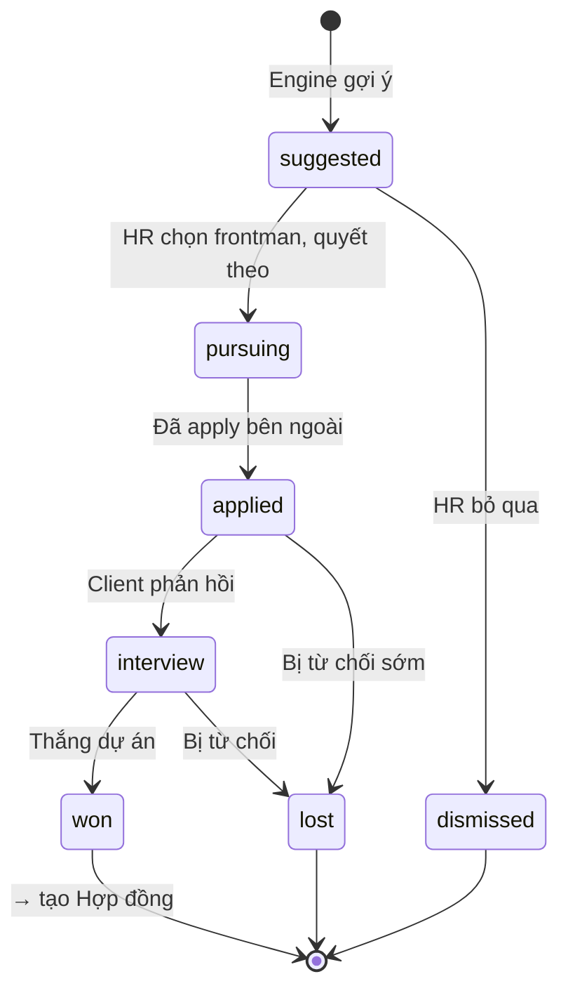
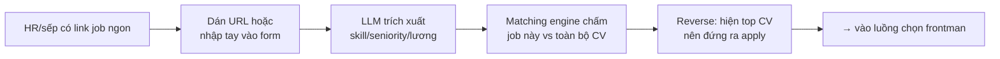

# JobFlow — Sơ đồ luồng nghiệp vụ & Phân tích màn hình

> Mô hình **HR Staffing / Shadow**: HR dùng CV nhân viên (bench) đi kiếm job ngoài → 1 CV đứng ra apply → thắng dự án → team trong công ty làm.
> Luồng chính = **Forward** (CV → jobs), trigger hằng ngày qua digest sáng.

---

## 1. Sơ đồ luồng nghiệp vụ chính (Daily Loop)

**Điểm mấu chốt:** sau khi thắng, **frontman quay lại bench** apply tiếp (H3) — đây là chỗ khác biệt so với staffing thường (người được match đi làm luôn).

---

## 2. State machine — Vòng đời 1 cơ hội (Application)

> Trạng thái gắn với **cặp (CV, Job)** — ghi rõ CV nào (frontman) apply job nào.

---

## 3. Luồng phụ — Nhập job thủ công (job hot từ client/sếp)

---

## 4. Phân tích MÀN HÌNH cần code

> Ký hiệu: ✅ đã có (giữ) · 🔧 đã có (nâng cấp) · 🆕 làm mới

### 4.1 — Dashboard (Trang chủ) 🔧 **[P1]**
**Mục đích:** HR mở buổi sáng là thấy ngay việc cần làm.
| Thành phần | Mô tả | Nguồn data |
|---|---|---|
| KPI cards | Bench utilization %, số job mới hôm nay, cơ hội đang chạy | aggregate API |
| **Banner "Cần xem ngay"** | Top nhân viên có nhiều job mới phù hợp | match count per employee |
| Pipeline funnel mini | gợi ý → apply → PV → thắng | application status |
| Hoạt động gần đây | Job mới crawl, cơ hội vừa won/lost | activity log |

### 4.2 — Danh sách Nhân viên 🔧 **[P1]**
**Mục đích:** trung tâm điều phối — ai rảnh, ai có job để apply.
| Thành phần | Mô tả |
|---|---|
| Bảng nhân viên | Tên, skills chính, seniority, trạng thái (bench/…) |
| **Badge "Y job mới"** | Số job phù hợp mới mỗi nhân viên (cái bạn mô tả) |
| Filter | Theo trạng thái, seniority, "rảnh từ ngày" |
| Nút "Add employees" | Upload CV đơn/bulk (zip/multi-file) |
| Empty/parse-fail state | CV lỗi → flag để fix tay |

### 4.3 — Chi tiết Nhân viên + Job match 🔧 **[P1]** ⭐ màn hình quan trọng nhất
**Mục đích:** HR xem list job của 1 CV → quyết apply.
| Thành phần | Mô tả |
|---|---|
| Hồ sơ nhân viên | Skills, seniority, kinh nghiệm, trạng thái, CV gốc |
| **Tab "Job phù hợp"** | List job xếp hạng + điểm 0–100 + badge màu |
| **Panel "Vì sao khớp" (explainability)** 🆕 | Skill khớp ✓ / thiếu ✗, gap seniority, lương — engine đã tính sẵn 23 feature |
| Filter job | Theo trạng thái apply / điểm / lương |
| Nút hành động | "Chọn apply (frontman)" · "Đánh dấu đã apply" · "Bỏ qua" |
| **Cảnh báo trùng** 🆕 | Báo nếu job đã có người khác apply |

### 4.4 — Bảng Pipeline Cơ hội (Kanban) 🆕 **[P1/P2]**
**Mục đích:** nhìn toàn bộ cơ hội đang chạy, kéo-thả cập nhật.
| Cột | gợi ý · sẽ apply · đã apply · phỏng vấn · thắng · thua |
|---|---|
| Mỗi thẻ | Nhân viên (frontman) + job + điểm + ghi chú |
| Hành động | Đổi trạng thái, thêm notes, mở job gốc |

### 4.5 — Nhập Job thủ công 🆕 **[P1]**
**Mục đích:** đưa job hot từ client/sếp vào hệ thống.
| Thành phần | Dán URL (auto-extract) hoặc form tay; nút "Tìm CV phù hợp" → reverse match |

### 4.6 — Reverse Match (Job → top CV) 🆕 **[P2]**
**Mục đích:** từ 1 job tìm frontman mạnh nhất.
| Thành phần | Chi tiết job + list CV xếp hạng + điểm + "vì sao khớp" + nút chọn apply |

### 4.7 — Hợp đồng & Giao hàng 🆕 **[P2]**
**Mục đích:** quản lý dự án đã thắng (tách khỏi người apply).
| Thành phần | List hợp đồng won, gán team thực thi, trạng thái delivering/done, cảnh báo quá tải |

### 4.8 — Báo cáo & KPI 🆕 **[P2]**
**Mục đích:** số liệu cho sếp.
| Thành phần | Bench utilization theo thời gian, win-rate theo frontman/loại job, time-to-win, funnel |

### 4.9 — Quản lý Job Catalog ✅ **[giữ]**
Đã có: browse/filter job, freshness tracker, verifier stats, schedule daemon, LLM logs.

### 4.10 — Đăng nhập / Auth ✅ **[giữ]**
Đã có: JWT, role admin/HR/manager.

---

> **Cập nhật 2026-06-05 (feature 014):** màn 4.2 (badge "job mới") và 4.3 (panel "Vì sao khớp" + cảnh báo apply trùng) đã triển khai; logic sai "won→placed" của #012 đã gỡ. Chi tiết: [specs/014-employee-shadow-enhance/](../specs/014-employee-shadow-enhance/plan.md).

## 5. Tổng hợp ưu tiên màn hình

| Ưu tiên | Màn hình | Trạng thái |
|---|---|---|
| **P1** | Dashboard (badge job mới), DS Nhân viên (badge), Chi tiết NV + explainability, Nhập job tay | 🔧 nâng cấp + 🆕 |
| **P2** | Pipeline Kanban, Reverse match, Hợp đồng, Báo cáo KPI | 🆕 |
| **Giữ** | Job catalog, Schedule, LLM logs, Auth | ✅ |

**Đường ngắn nhất ra giá trị:** 4.1 + 4.2 + 4.3 (nâng cấp 3 màn đã có + thêm explainability) → phủ trọn luồng "sáng vào thấy CV X có Y job → bấm xem list → quyết apply" mà bạn mô tả.
